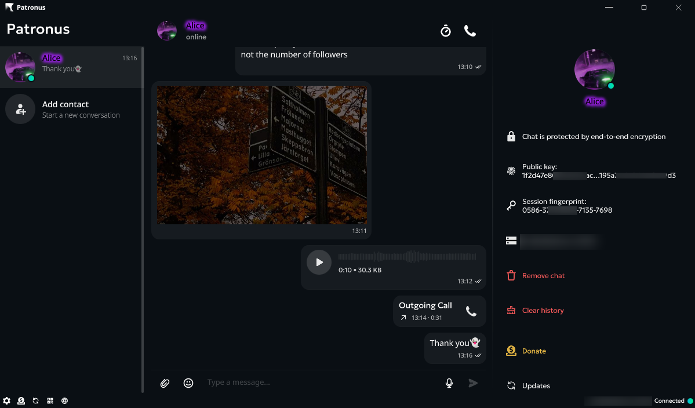
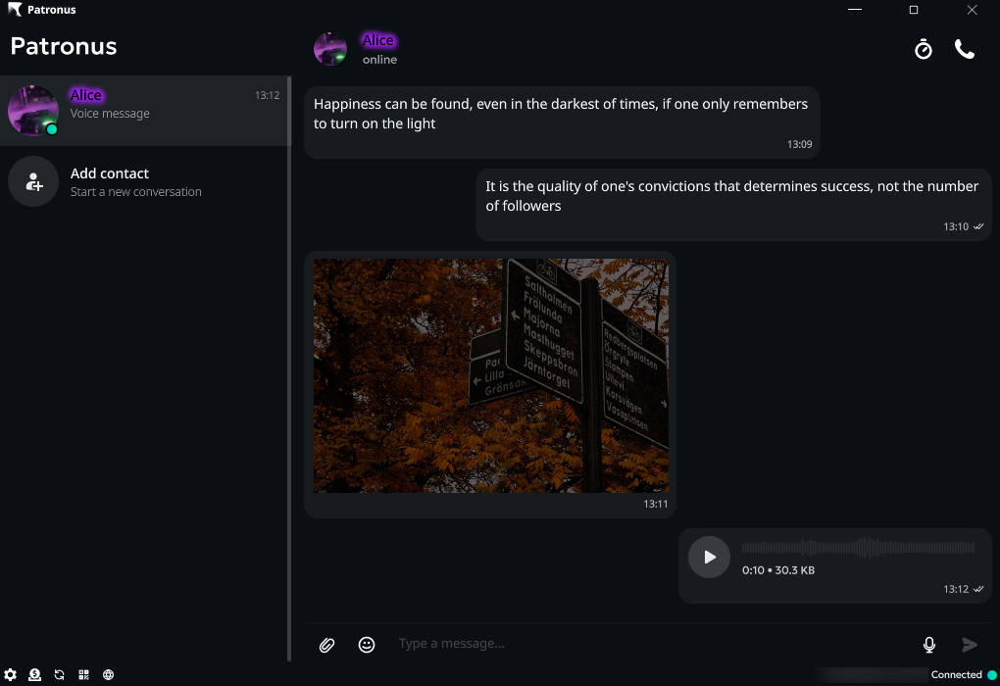
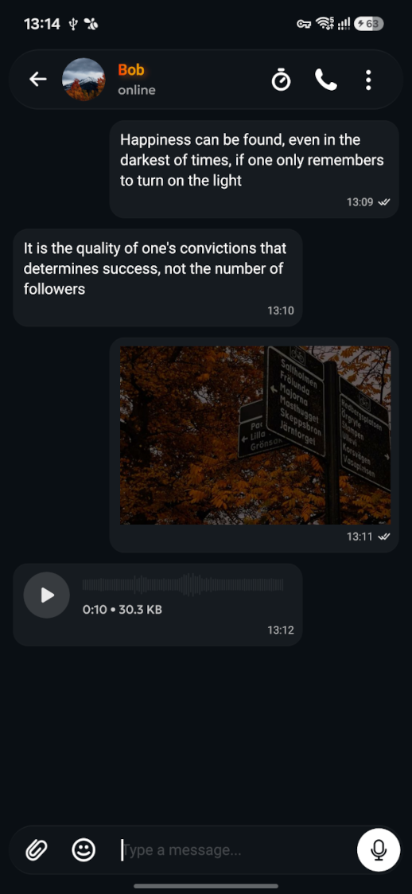
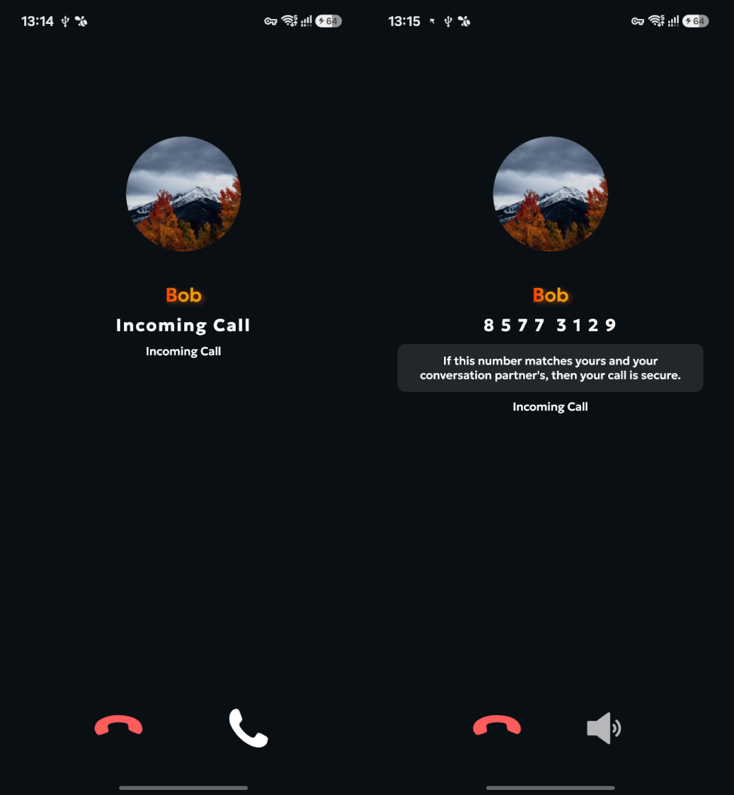
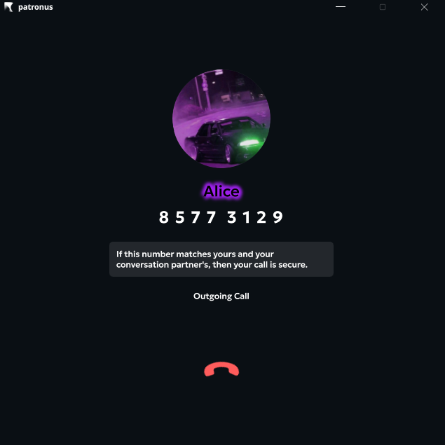

<p align="center">
	
	
</p>

>
> Reclaim your right to privacy in your correspondence and personal life
>
>
> Верните себе право на тайну переписки и личной жизни
>

English: [Overview](#overview) | [Quick Start](#quick-start) | [Screenshots](#screenshots) | [Comparison](#comparison) | [Repository Layout](#repository-layout) | [Build From Source](#build-from-source) | [Self-Hosted Server](#self-hosted-server) | [Security Model](#security-model) | [Updates](UPDATES.md) | [Beta Status](#beta-status) | [Disclaimer](#disclaimer) | [Roadmap](#roadmap) | [Donate](DONATE.md)

Русский: [Обзор](#обзор) | [Быстрый старт](#быстрый-старт) | [Скриншоты](#screenshots) | [Сравнение](#сравнение) | [Структура репозитория](#структура-репозитория) | [Сборка из исходников](#сборка-из-исходников) | [Собственный сервер](#собственный-сервер) | [Модель безопасности](#модель-безопасности) | [Обновления](UPDATES.md) | [Бета-статус](#бета-статус) | [Дисклеймер](#дисклеймер) | [Дорожная карта](#дорожная-карта) | [Донаты](DONATE.md)



## Overview

Patronus is a privacy-first end-to-end encrypted messenger built around one central idea: security and secrecy of correspondence come first.

This project is not trying to imitate Telegram or WhatsApp. Its goal is to provide a communication channel that users can treat as maximally protected against interception, disclosure, and infrastructure-level pressure.

The repository is intentionally kept as a single monorepo because all parts are tightly connected:

1. The Qt/C++ client depends on the in-repo cryptographic and messaging components.
2. The server is designed specifically for this protocol and deployment model.
3. The cryptographic support libraries evolve together with the client and server.
4. The certificate generation utility and Android dependencies are part of the same operational workflow.

This project is currently in beta. Bugs, rough edges, missing features, and unexpected behavior are possible. We will keep fixing issues, improving stability, refactoring the codebase, and pushing the project toward the level of quality expected from a serious modern messenger.

The project is free of charge for non-commercial use. We do not charge subscription fees, we do not sell paid plans, and we want the code to remain open for independent security review and rapid improvement.

The source code is published under a restricted all-rights-reserved model for audit, source builds, and contributions to the official repository. See [LICENSE](LICENSE) and [CONTRIBUTING.md](CONTRIBUTING.md) for the exact rules.

If you want to support that work, see [DONATE.md](DONATE.md).

Every contribution helps us spend more time on development, infrastructure, bug fixing, protocol hardening, and improving the reliability of a messenger whose primary purpose is to protect private communication.

We are also actively looking for foundations and institutions willing to sponsor the project and help move it into a more official and sustainable direction.

If you have ideas, partnership proposals, infrastructure suggestions, funding opportunities, or other forms of cooperation, contact us at cathxrsys contact.

## Quick Start

If you already know why this project exists and just want the right entry point:

1. End users: read [Updates](UPDATES.md) and use published release artifacts.
2. Developers: go to [Build From Source](#build-from-source).
3. Server operators: go to [Self-Hosted Server](#self-hosted-server).
4. Security-minded readers: go to [Security Model](#security-model) and [Comparison](#comparison).

## Screenshots









## Comparison

The tables below focus on public high-level behavior and default user experience. For third-party products, `❗` means either partial support, configuration-dependent behavior, or the lack of enough reliable public technical detail for a strict `yes` or `no`.

Legend: `✅` yes, `❌` no, `❗` partial / conditional / not clearly documented.

### Architecture And Security

| Messenger | E2E For Content | E2E By Default | No Server Plaintext Access | Self-Hosted | Protects Chats And Account From Simple Offline Disk Extraction By App Means | No Central Server / No Single Point Of Failure | Metadata Hiding | Mobile Push | Cross-Platform |
| --- | --- | --- | --- | --- | --- | --- | --- | --- | --- |
| Patronus | ✅ | ✅ | ✅ | ✅ | ❌ | ✅ | ❌ | ✅ | ✅ |
| Signal | ✅ | ✅ | ✅ | ❌ | ✅ | ❌ | ❗ | ✅ | ✅ |
| WhatsApp | ✅ | ✅ | ✅ | ❌ | ✅ | ❌ | ❌ | ✅ | ✅ |
| Telegram | ❗ | ❌ | ❌ | ❌ | ✅ | ❌ | ❌ | ✅ | ✅ |
| Element / Matrix | ❗ | ❗ | ❗ | ✅ | ❗ | ✅ | ❗ | ✅ | ✅ |
| MAX | ❌ | ❌ | ❌ | ❌ | ❌ | ❌ | ❌ | ✅ | ✅ |

### Messaging And Collaboration

| Messenger | Text | Voice Messages | Video Messages | Voice Calls | Video Calls | Group Chats | Group Calls | Files | Media | Channels / Broadcast Walls |
| --- | --- | --- | --- | --- | --- | --- | --- | --- | --- | --- |
| Patronus | ✅ | ✅ | ❌ | ✅ | ❌ | ❌ | ❌ | ✅ | ✅ | ❌ |
| Signal | ✅ | ✅ | ❗ | ✅ | ✅ | ✅ | ✅ | ✅ | ✅ | ❌ |
| WhatsApp | ✅ | ✅ | ✅ | ✅ | ✅ | ✅ | ✅ | ✅ | ✅ | ✅ |
| Telegram | ✅ | ✅ | ✅ | ✅ | ✅ | ✅ | ✅ | ✅ | ✅ | ✅ |
| Element / Matrix | ✅ | ✅ | ❗ | ✅ | ✅ | ✅ | ✅ | ✅ | ✅ | ❗ |
| MAX | ✅ | ✅ | ✅ | ✅ | ✅ | ✅ | ✅ | ✅ | ✅ | ✅ |

### Identity And UX

| Messenger | Emoji | Reactions | Name / Bio | Avatars | Key Verification | Modern UI |
| --- | --- | --- | --- | --- | --- | --- |
| Patronus | ✅ | ❌ | ✅ | ✅ | ✅ | ✅ |
| Signal | ✅ | ✅ | ✅ | ✅ | ✅ | ✅ |
| WhatsApp | ✅ | ✅ | ✅ | ✅ | ✅ | ✅ |
| Telegram | ✅ | ✅ | ✅ | ✅ | ❗ | ✅ |
| Element / Matrix | ✅ | ✅ | ✅ | ✅ | ✅ | ❗ |
| MAX | ✅ | ✅ | ✅ | ✅ | ❌ | ✅ |

Implementation Notes For Patronus:

1. Protection against simple offline disk extraction already exists in the codebase, but it is not yet enabled in the current practical client builds.
2. Patronus prioritizes secrecy of message content over hiding the fact that communication took place.
3. The desktop application builds well on macOS, but the practical repository workflow for macOS will be written later, and built-in macOS updates will also be implemented later.
4. iOS remains a target platform, but the iPhone client will be implemented later because installing such an application on iPhone without the App Store is technically difficult.

Most of the features that are currently missing are expected to be integrated in the near term. Some are already implemented and are currently being tested, while the rest are scheduled as the team continues to push the project forward.

## Repository Layout

The repository currently contains these major parts:

1. `client/` — the desktop and Android Qt 6 client, QML UI, build scripts, translations, and Android packaging files.
2. `server/` — the self-hosted Go server used by messenger clients as their communication channel.
3. `corecrypto/` — low-level cryptographic helpers and mnemonic / key derivation utilities.
4. `doubleratchet/` — the protocol and ratchet implementation used by the client.
5. `coreutils/` — shared support code.
6. `certgen/` — a small utility that generates a mnemonic, derives keys, and writes a certificate JSON file.
7. `images/` — screenshots used in this documentation.

## Security Model

The messenger is designed as a fully end-to-end encrypted system.

The server can see only:

1. Which public address talks to which public address.
2. Metadata such as approximate timing, connection IPs, and other transport-level facts necessary to relay traffic.
3. Delivery and read-state information.

The server does not get the plaintext content of messages.

Text messages, files, calls, video, voice messages, avatar, `first_name`, `last_name`, and `bio` are transferred inside the end-to-end encrypted channel between two clients. In that sense, the server acts as a relay and coordination point, not as a trusted content processor.

The ratchet layer in this project follows the same core principles as PQDH and Double Ratchet in Signal, adapted to this codebase and deployment model.

The main idea of this messenger should be understood clearly: it is built around privacy and secrecy of correspondence first. Feature parity with mass-market messengers is not the primary goal. Confidentiality is.

## Self-Hosted Server

The server is not a side feature. It is a core part of the architecture, and it should be self-hosted.

That is the point of the system.

Each communication channel is deployed independently. Clients then work with their own chosen server. Because of that, the system is not centered around a single universal server endpoint, and large-scale blocking is fundamentally harder than with centralized messengers.

If you use the messenger seriously, deploy your own server.

The Go server lives in `server/`, uses PostgreSQL, serves clients over TLS, and initializes its own database schema on startup. It supports a configuration file and CLI overrides.

### Practical Self-Hosting Flow

The shortest realistic deployment flow is:

1. Prepare PostgreSQL.
2. Issue or generate a TLS certificate and private key for your domain or IP.
3. Build the Go server.
4. Fill in `server/config.json` with your own values.
5. Run the server and point clients to `host:port`.

The server terminates TLS itself and accepts WebSocket upgrades on `/`. A plain HTTPS request to `/` returns a decoy HTML page, while messenger traffic uses the WebSocket path on the same endpoint.

### PostgreSQL Example

The server needs a PostgreSQL database and a user with access to it.

Example:

```bash
sudo -u postgres psql
CREATE USER patronus WITH PASSWORD 'change-me';
CREATE DATABASE patronus OWNER patronus;
\q
```

You can then use a connection string similar to:

```text
host=127.0.0.1 port=5432 dbname=patronus user=patronus password=change-me sslmode=disable
```

The server creates and upgrades its own schema on startup. If `id` is set, `db_schema` and `file_storage_path` are resolved per instance. The placeholder `{id}` is supported, and if you do not use it in `file_storage_path`, the instance id is appended automatically.

### TLS Certificates

For production, use a normal CA-issued certificate for the hostname that clients will connect to.

For testing, you can generate a self-signed certificate, for example:

```bash
openssl req -x509 -newkey rsa:4096 -sha256 -nodes -days 365 \
	-keyout server.key \
	-out server.crt \
	-subj "/CN=messenger.example.com" \
	-addext "subjectAltName=DNS:messenger.example.com"
```

If clients connect to an IP address directly, include an IP SAN as well:

```bash
openssl req -x509 -newkey rsa:4096 -sha256 -nodes -days 365 \
	-keyout server.key \
	-out server.crt \
	-subj "/CN=203.0.113.10" \
	-addext "subjectAltName=IP:203.0.113.10"
```

Put the resulting files where the server can read them and point `ssl_cert_file` and `ssl_key_file` to those paths.

If you use a self-signed certificate, clients may need to trust that certificate explicitly or enable the client setting that ignores SSL errors. That can be useful for testing, but it is not a production-grade transport setup.

### Example `server/config.json`

This is a practical minimal example for a single self-hosted instance without Firebase push:

```json
{
	"id": "home-server",
	"ip": "0.0.0.0",
	"port": 443,
	"ssl_cert_file": "/etc/patronus/server.crt",
	"ssl_key_file": "/etc/patronus/server.key",
	"db_connection_string": "host=127.0.0.1 port=5432 dbname=patronus user=patronus password=change-me sslmode=disable",
	"db_schema": "patronus_{id}",
	"db_connection_pool_size": 16,
	"file_storage_path": "/srv/patronus/files/{id}",
	"file_ttl_seconds": 604800,
	"max_file_size": 0,
	"max_storage_size": 0,
	"fcm_client_config_file": "",
	"fcm_service_account_file": ""
}
```

What matters here:

1. `id` may contain only letters, digits, `_`, and `-`.
2. `db_schema` must end up as a valid PostgreSQL schema name, so hyphens from `id` are normalized when `{id}` is expanded.
3. `file_storage_path` should point to a writable directory.
4. `fcm_client_config_file` and `fcm_service_account_file` are optional. If they are both empty, push notifications are disabled.

### Firebase Push Notifications For Android

Android mobile push delivery is implemented through Firebase Cloud Messaging.

A practical deployment flow is:

1. Create a Firebase project for your server deployment.
2. Register the Android application inside that Firebase project.
3. Download the public client configuration file, typically `google-services.json`.
4. Create a Firebase service account with permission to send messages and download its JSON credentials.
5. Point `fcm_client_config_file` to the public client config JSON.
6. Point `fcm_service_account_file` to the private service-account JSON.

Important separation:

1. `fcm_client_config_file` is public client-side metadata.
2. `fcm_service_account_file` is private server-side credential material.
3. The server explicitly refuses to serve a file that looks like a service-account JSON to the client.

Relevant server behavior:

1. If `fcm_client_config_file` is present, the server can derive `fcm_project_id`, `fcm_api_key`, and `fcm_app_id` from it.
2. If both `fcm_client_config_file` and `fcm_service_account_file` are configured, FCM is considered enabled.
3. The server exposes authenticated `GET /fcm/client-config` for clients.
4. The server stores device tokens in PostgreSQL and uses the Firebase HTTP v1 API to send pushes for offline delivery.

Relevant client behavior:

1. After authentication, the Android client requests `/fcm/client-config` from its chosen server using the session access token.
2. The client therefore asks the server where it should subscribe for push delivery instead of shipping a hardcoded push target per server.
3. The Android runtime is initialized with the config received from that server.
4. The client then uses a cached FCM token or requests a fresh one.
5. The client registers that token back to the server over the authenticated messenger channel.

If FCM is disabled on the server:

1. `GET /fcm/client-config` returns `204 No Content`.
2. Token registration requests are acknowledged as not used.
3. The Android client disables FCM state for that server.

Example configuration fragment:

```json
{
	"fcm_client_config_file": "/etc/patronus/google-services.json",
	"fcm_service_account_file": "/etc/patronus/firebase-service-account.json",
	"fcm_request_timeout_seconds": 10
}
```

Operational recommendation: use a separate Firebase project for each deployment you control, keep the service-account JSON private, and serve only the public client config to mobile clients.

### Build And Run Your Server

```bash
cd server
go build -o patronus-server .
./patronus-server --config ./config.json
```

On the first successful run the server will:

1. Load and validate configuration.
2. Connect to PostgreSQL.
3. Initialize the database schema.
4. Prepare the file storage directory.
5. Start the TLS listener.

Once it is running, set the client server address to the public endpoint you actually expose, for example:

```text
messenger.example.com:443
```

### What `certgen` Does And Does Not Do

`certgen/` is not a TLS certificate generator for the Go server.

It generates a mnemonic phrase, derives a signing key pair, prints the public key fingerprint, and writes `certificate.json`. That is useful for development, experiments, and low-level protocol work.

For normal client use, account identity is usually created directly inside the client from a mnemonic phrase. For server deployment, the certificates you need first are the TLS files referenced by `ssl_cert_file` and `ssl_key_file`.

If you want to document client auto-updates for your own releases, see [UPDATES.md](UPDATES.md).

## Beta Status

This repository represents a beta-stage project.

You should expect:

1. Incomplete features.
2. Bugs and regressions.
3. UI and UX changes.
4. Internal refactoring.
5. Protocol and deployment hardening over time.

The Patronus developers have a very strong desire to make this project substantially better. Most of the features that are still missing are planned for implementation in the near term, and some of them are already implemented internally and are now going through testing.

The direction of the project is clear:

1. Better usability.
2. Fewer bugs.
3. Ongoing refactoring.
4. Better operational reliability.
5. Closer alignment with the de facto global standards expected from a good messenger.

## Build From Source

This section focuses on the practical desktop build workflows that are currently used in this repository.

If you want a shorter and more concrete build checklist, also see [BUILD.md](BUILD.md).

Important notes before you start:

1. The desktop client build depends on the static libraries built in `corecrypto/build/` and `doubleratchet/build/`.
2. The client build scripts are designed around a Linux host and Qt installed under a home directory.
3. Run the build scripts from inside `client/`, not from the repository root.
4. The Android scripts validate dependencies early and stop on the first missing component.
5. For packaged Android builds, set `ANDROID_PLATFORM=android-35` unless you have explicitly adapted the rest of the toolchain.

### Build Order

For a clean checkout, the practical order is:

1. Build `corecrypto`.
2. Build `doubleratchet`.
3. Optionally build `certgen`.
4. Build the desktop client with `client/build_debug.sh` or `client/build_release.sh`.
5. Build Android artifacts with `client/build_android_debug.sh` or `client/build_android_release.sh`.
6. Build the Go server in `server/`.

The main scenarios are:

1. Building the desktop client locally on your Linux machine in debug or release mode.
2. Building a portable AppImage for Linux in debug or release mode.
3. Building a portable Windows `.exe` in debug or release mode.

The desktop application also builds well on macOS, but the exact repository workflow for macOS will be documented later. Built-in macOS update support is also planned for later rather than documented as a current production path.

### Linux Desktop Build

This is the normal workflow if you want to run the desktop client on your own Linux machine.

#### 1. Install Qt 6.9.3 into `~/Qt`

Use the official Qt Online Installer.

Download pages:

1. `https://www.qt.io/download-open-source`
2. `https://www.qt.io/download-qt-installer-oss`
3. `https://doc.qt.io/qt-6/get-and-install-qt.html`

Install Qt `6.9.3` under `~/Qt` and make sure the desktop kit is present at:

```text
~/Qt/6.9.3/gcc_64
```

In the Qt Online Installer, install at least:

1. `Qt 6.9.3 -> Desktop gcc 64-bit`
2. `Linguist Tools`
3. The Qt modules required by this client: `Core`, `Gui`, `Network`, `Qml`, `Quick`, `Sql`, `WebSockets`, `Concurrent`, `Multimedia`, `Widgets`, `Svg`

You can verify the installation like this:

```bash
ls "$HOME/Qt/6.9.3/gcc_64/lib/cmake/Qt6/qt.toolchain.cmake"
ls "$HOME/Qt/6.9.3/gcc_64/lib/cmake/Qt6LinguistTools/Qt6LinguistToolsConfig.cmake"
```

#### 2. Install Linux build dependencies

```bash
sudo apt install build-essential git cmake pkg-config \
	libopus-dev libsodium-dev libspdlog-dev libssl-dev \
	nlohmann-json3-dev ffmpeg
```

#### 3. Install `liboqs`

```bash
cd /tmp
git clone https://github.com/open-quantum-safe/liboqs.git
cd liboqs

mkdir build && cd build
cmake -DBUILD_SHARED_LIBS=ON ..
make -j"$(nproc)"
sudo make install
sudo ldconfig
```

#### 4. Build `corecrypto` and `doubleratchet`

```bash
cd /path/to/patronus/corecrypto
mkdir -p build && cd build
cmake ..
make -j"$(nproc)"

cd /path/to/patronus/doubleratchet
mkdir -p build && cd build
cmake ..
make -j"$(nproc)"
```

#### 5. Build the desktop client

```bash
cd /path/to/patronus/client
./build_debug.sh --home-path "$HOME"
```

If Qt is installed somewhere other than `~/Qt`, override `QT_ROOT` explicitly:

```bash
cd /path/to/patronus/client
QT_ROOT=/opt/Qt ./build_debug.sh --home-path "$HOME"
```

The release build entry point is:

```bash
cd /path/to/patronus/client
./build_release.sh --home-path "$HOME"
```

#### 6. Result

After a successful debug build, the desktop binary is created as `client/build-debug/patronus`.

After a successful release build, the desktop binary is created as `client/build-release/patronus`.

### Linux Portable AppImage Build

Use this workflow if you want a portable Linux AppImage.

#### 1. Install AppImage tooling and system packages

The AppImage packaging tool is downloaded automatically inside `client/build_appimage_release.sh` or `client/build_appimage_debug.sh`, so you do not need to download `linuxdeploy` or any Qt plugin manually.

```bash
sudo apt install desktop-file-utils libfuse2 patchelf ffmpeg
```

#### 2. Run the AppImage build script

```bash
cd /path/to/patronus/client
./build_appimage_release.sh
```

If you need a debug AppImage instead, run:

```bash
cd /path/to/patronus/client
./build_appimage_debug.sh
```

This script rebuilds:

1. `corecrypto`
2. `doubleratchet`
3. the desktop client itself
4. the final AppImage bundle

#### 3. Result

The resulting portable artifact is:

```text
client/patronus-x86_64.AppImage
```

When launched as AppImage, the client stores its working data in a `PatronusData/` directory located next to the AppImage itself.

If the AppImage does not start normally, you can run the extracted bundle manually:

```bash
./patronus-x86_64.AppImage --appimage-extract
cd squashfs-root
./AppRun
```

### Windows Portable EXE Build

Use this workflow if you want a portable Windows `.exe` build.

#### 1. Install the required Windows toolchain

Install:

1. Microsoft Visual Studio.
2. MSVC toolsets `v145` and `v141`.
3. CMake.
4. Git.
5. Python.
6. Strawberry Perl if Qt configuration asks for it. In the workflow note it is optional.

#### 2. Build and install static Qt 6.9.3

Download `qt-everywhere-src-6.9.3`, then configure, build, and install it as a static Qt distribution.

Example commands:

```bat
C:\qt-everywhere-src-6.9.3\configure.bat -release -static -static-runtime -opensource -confirm-license -platform win32-msvc -qt-zlib -qt-libpng -qt-libjpeg -nomake examples -nomake tests -prefix "C:\Qt\6.9.3-static"

ninja
ninja install
```

The expected install prefix in this workflow is:

```text
C:\Qt\6.9.3-static
```

#### 3. Install third-party dependencies with `vcpkg`

```bat
.\vcpkg install libsodium:x64-windows-static opus:x64-windows-static spdlog:x64-windows-static fmt:x64-windows-static openssl:x64-windows-static nlohmann-json:x64-windows-static
```

#### 4. Build and install `liboqs`

```bat
git clone https://github.com/open-quantum-safe/liboqs.git C:\liboqs

cd C:\liboqs
mkdir build && cd build
cmake -G "Visual Studio 18 2026" -A x64 -DBUILD_SHARED_LIBS=OFF -DCMAKE_INSTALL_PREFIX=C:/liboqs_static ..

cmake --build . --config Release --parallel
cmake --install .
```

#### 5. Run the Windows release build script

```bat
cd \path\to\patronus\client
build_windows_release.bat
```

This script is the repository entry point for the Windows portable release workflow.

The debug counterpart is:

```bat
build_windows_debug.bat
```

### Android Build Notes

The desktop workflows above are the simplest supported Linux paths. Android client prerequisites expected by the scripts are:

1. `build_android_debug.sh` — Android development build and packaging.
2. `build_android_release.sh` — Android release build and packaging.
3. Both Android scripts require the `--home-path` argument.

Android client prerequisites expected by the scripts:

1. Qt 6.9.3 desktop host kit at `Qt/<version>/gcc_64`.
2. Qt 6.9.3 Android kit at `Qt/<version>/android_arm64_v8a`.
3. Android SDK.
4. Android NDK `27.2.12479018` or a compatible override.
5. Android platform `android-35` if you want `apk`, `aab`, or `both` packaging targets.
6. Prebuilt Android third-party libraries under `client/third_party/android/arm64-v8a/` including `libsodium`, `spdlog`, `fmt`, `opus`, OpenSSL, and `liboqs`.

### Prepare `client/third_party` For Android

If `client/third_party/` is not included in the public repository, the target user must prepare these Android dependencies manually before running `build_android_debug.sh` or `build_android_release.sh`.

The scripts and CMake files expect this exact prefix layout for ABI `arm64-v8a`:

```text
client/third_party/android/arm64-v8a/
├── include/
│   ├── fmt/
│   ├── nlohmann/
│   ├── openssl/
│   ├── opus/
│   ├── oqs/
│   ├── sodium/
│   ├── sodium.h
│   └── spdlog/
└── lib/
		├── libcrypto.a
		├── libfmt.a
		├── libopus.a
		├── liboqs.a
		├── libsodium.a
		├── libspdlog.a
		├── libssl.a
		└── runtime/
```

At minimum, the Android build expects these headers and libraries to exist:

1. `libsodium` headers and `libsodium.a`
2. `spdlog` headers and `libspdlog.a`
3. `fmt` headers and `libfmt.a`
4. `opus` headers and `libopus.a`
5. `OpenSSL` headers and `libssl.a` plus `libcrypto.a`
6. `liboqs` headers and `liboqs.a`
7. `nlohmann/json` headers

The practical workflow for a user building these dependencies is:

1. Install Android SDK and Android NDK.
2. Choose ABI `arm64-v8a`.
3. Choose Android API level `35` to match the rest of the Android build flow.
4. Create a common install prefix at `client/third_party/android/arm64-v8a`.
5. Build every required upstream dependency from its official source using the Android NDK toolchain.
6. Install headers into `include/` and static libraries into `lib/` under that prefix.

A typical environment looks like this:

```bash
export ANDROID_NDK_ROOT=/path/to/Android/Sdk/ndk/27.2.12479018
export ANDROID_ABI=arm64-v8a
export ANDROID_PLATFORM=android-35
export TOOLCHAIN_FILE="$ANDROID_NDK_ROOT/build/cmake/android.toolchain.cmake"
export PREFIX="$(pwd)/client/third_party/android/$ANDROID_ABI"
mkdir -p "$PREFIX"
```

For dependencies that support CMake, the usual pattern is:

```bash
cmake -S . -B build-android -G Ninja \
	-DCMAKE_TOOLCHAIN_FILE="$TOOLCHAIN_FILE" \
	-DANDROID_ABI="$ANDROID_ABI" \
	-DANDROID_PLATFORM="$ANDROID_PLATFORM" \
	-DCMAKE_BUILD_TYPE=Release \
	-DCMAKE_INSTALL_PREFIX="$PREFIX"

cmake --build build-android --parallel
cmake --install build-android
```

For dependencies that use Autotools or their own build system, use their official Android cross-compilation instructions, but make sure the final result is still installed into the same prefix.

Practical notes for each dependency:

1. `spdlog` is mostly header-only upstream, but this project expects `libspdlog.a`, so build and install it as a static library.
2. `fmt` must also be installed as a static library.
3. `nlohmann/json` is header-only, so only the headers need to be copied into `include/nlohmann/`.
4. `OpenSSL` must provide both headers and the static archives `libssl.a` and `libcrypto.a`.
5. `liboqs` must be compiled for Android and installed with its public headers under `include/oqs/`.
6. `libsodium` must provide `include/sodium.h`, the `include/sodium/` directory, and `libsodium.a`.
7. `opus` must provide its public headers in `include/opus/` and `libopus.a`.

Example commands for preparing the prefix:

`fmt`

```bash
git clone https://github.com/fmtlib/fmt.git
cd fmt
cmake -S . -B build-android -G Ninja \
	-DCMAKE_TOOLCHAIN_FILE="$TOOLCHAIN_FILE" \
	-DANDROID_ABI="$ANDROID_ABI" \
	-DANDROID_PLATFORM="$ANDROID_PLATFORM" \
	-DCMAKE_BUILD_TYPE=Release \
	-DCMAKE_INSTALL_PREFIX="$PREFIX" \
	-DBUILD_SHARED_LIBS=OFF \
	-DFMT_TEST=OFF
cmake --build build-android --parallel
cmake --install build-android
```

`spdlog`

```bash
git clone https://github.com/gabime/spdlog.git
cd spdlog
cmake -S . -B build-android -G Ninja \
	-DCMAKE_TOOLCHAIN_FILE="$TOOLCHAIN_FILE" \
	-DANDROID_ABI="$ANDROID_ABI" \
	-DANDROID_PLATFORM="$ANDROID_PLATFORM" \
	-DCMAKE_BUILD_TYPE=Release \
	-DCMAKE_INSTALL_PREFIX="$PREFIX" \
	-DSPDLOG_BUILD_SHARED=OFF \
	-DSPDLOG_BUILD_EXAMPLE=OFF \
	-DSPDLOG_BUILD_TESTS=OFF \
	-DSPDLOG_BUILD_BENCH=OFF \
	-DSPDLOG_FMT_EXTERNAL=ON \
	-DCMAKE_PREFIX_PATH="$PREFIX"
cmake --build build-android --parallel
cmake --install build-android
```

`nlohmann/json`

```bash
git clone https://github.com/nlohmann/json.git
cd json
mkdir -p "$PREFIX/include"
cp -r include/nlohmann "$PREFIX/include/"
```

`libsodium`

```bash
git clone https://github.com/jedisct1/libsodium.git
cd libsodium
export TOOLBIN="$ANDROID_NDK_ROOT/toolchains/llvm/prebuilt/linux-x86_64/bin"
export CC="$TOOLBIN/aarch64-linux-android35-clang"
export AR="$TOOLBIN/llvm-ar"
export RANLIB="$TOOLBIN/llvm-ranlib"
./autogen.sh
./configure \
	--host=aarch64-linux-android \
	--prefix="$PREFIX" \
	--disable-shared \
	--enable-static
make -j"$(nproc)"
make install
```

`opus`

```bash
git clone https://github.com/xiph/opus.git
cd opus
cmake -S . -B build-android -G Ninja \
	-DCMAKE_TOOLCHAIN_FILE="$TOOLCHAIN_FILE" \
	-DANDROID_ABI="$ANDROID_ABI" \
	-DANDROID_PLATFORM="$ANDROID_PLATFORM" \
	-DCMAKE_BUILD_TYPE=Release \
	-DCMAKE_INSTALL_PREFIX="$PREFIX" \
	-DBUILD_SHARED_LIBS=OFF \
	-DOPUS_BUILD_TESTING=OFF
cmake --build build-android --parallel
cmake --install build-android
```

`OpenSSL`

```bash
git clone https://github.com/openssl/openssl.git
cd openssl
export TOOLBIN="$ANDROID_NDK_ROOT/toolchains/llvm/prebuilt/linux-x86_64/bin"
export PATH="$TOOLBIN:$PATH"
./Configure android-arm64 \
	no-shared no-tests no-unit-test \
	--prefix="$PREFIX"
make -j"$(nproc)"
make install_sw
```

`liboqs`

```bash
git clone https://github.com/open-quantum-safe/liboqs.git
cd liboqs
cmake -S . -B build-android -G Ninja \
	-DCMAKE_TOOLCHAIN_FILE="$TOOLCHAIN_FILE" \
	-DANDROID_ABI="$ANDROID_ABI" \
	-DANDROID_PLATFORM="$ANDROID_PLATFORM" \
	-DCMAKE_BUILD_TYPE=Release \
	-DCMAKE_INSTALL_PREFIX="$PREFIX" \
	-DBUILD_SHARED_LIBS=OFF \
	-DOQS_BUILD_ONLY_LIB=ON \
	-DOQS_USE_OPENSSL=OFF
cmake --build build-android --parallel
cmake --install build-android
```

After installation, verify that the files expected by this repository are present:

```bash
test -f "$PREFIX/lib/libfmt.a"
test -f "$PREFIX/lib/libspdlog.a"
test -f "$PREFIX/lib/libsodium.a"
test -f "$PREFIX/lib/libopus.a"
test -f "$PREFIX/lib/libssl.a"
test -f "$PREFIX/lib/libcrypto.a"
test -f "$PREFIX/lib/liboqs.a"
test -f "$PREFIX/include/nlohmann/json.hpp"
test -f "$PREFIX/include/sodium.h"
test -f "$PREFIX/include/oqs/oqs.h"
```

After the static OpenSSL archives are present, the Android build scripts will automatically derive runtime shared objects in `client/third_party/android/arm64-v8a/lib/runtime/` when needed.

If the directory layout or filenames differ from the expected ones above, the Android CMake configuration will fail early with explicit missing-file errors.

Server prerequisites:

1. Go 1.22.2 or newer.
2. PostgreSQL.
3. TLS certificate and private key.

### Build `corecrypto`

The desktop client links against `corecrypto/build/libcorecrypto.a`, so build it first.

```bash
cd corecrypto
mkdir -p build
cmake -S . -B build -G Ninja
cmake --build build --parallel
```

Expected result:

1. Static library in `corecrypto/build/`.

### Build `doubleratchet`

The desktop client also expects `doubleratchet/build/libdoubleratchet.a`.

```bash
cd doubleratchet
mkdir -p build
cmake -S . -B build -G Ninja
cmake --build build --parallel
```

Expected result:

1. Static library in `doubleratchet/build/`.

### Build `certgen`

This utility is optional, but it is part of the repository and can be built from source as well.

```bash
cd certgen
mkdir -p build
cmake -S . -B build -G Ninja
cmake --build build --parallel
```

Expected result:

1. `certgen/build/certgen` executable.

When you run it, it generates a mnemonic phrase, derives a key pair, shows the public key fingerprint, and writes `certificate.json` in the current working directory.

### Build Desktop Client

The desktop client build scripts work from the `client/` directory.

```bash
cd client
./build_debug.sh --home-path /home/your-user
```

What the script does:

1. Resolves `QT_ROOT` as `/home/your-user/Qt` unless you override it.
2. Finds the newest desktop Qt `gcc_64` kit under that Qt root.
3. Rebuilds `corecrypto` and `doubleratchet` first.
4. Configures CMake using the Qt toolchain and Qt CMake package path.
5. Builds the `patronus` target.

Expected artifact:

1. `client/build-debug/patronus` for `build_debug.sh`
2. `client/build-release/patronus` for `build_release.sh`

### Build Android Development Artifacts

The Android development build script is `client/build_android_debug.sh`.

Minimal example:

```bash
cd client
./build_android_debug.sh --home-path /home/your-user
```

Important behavior:

1. The script defaults to `QT_VERSION=6.9.3`.
2. The default ABI is `arm64-v8a`.
3. The default package mode is `apk`.
4. The default `ANDROID_PLATFORM` is `android-35`.
5. Packaging with `apk`, `aab`, or `both` requires `ANDROID_PLATFORM=android-35` or newer.
6. The script verifies the presence of Qt host tools, Qt Android kit, Android SDK, Android NDK, and required third-party static libraries.
7. The script builds `corecrypto` and `doubleratchet` before the Android client target.
8. The script builds shared OpenSSL runtime libraries from the static Android OpenSSL archives when needed.
9. The script configures CMake with the Qt Android toolchain and builds the project with Ninja.

Useful overrides:

1. `PACKAGE_FORMAT=none` — configure and build native Android outputs without packaging.
2. `PACKAGE_FORMAT=apk` — build APK.
3. `PACKAGE_FORMAT=aab` — build Android App Bundle.
4. `PACKAGE_FORMAT=both` — build both APK and AAB.
5. `ANDROID_SDK_ROOT=/path/to/sdk` — override SDK path.
6. `ANDROID_NDK_ROOT=/path/to/ndk` — override NDK path.
7. `BUILD_DIR=/custom/path` — override build directory.

Examples:

```bash
cd client
PACKAGE_FORMAT=none ./build_android_debug.sh --home-path /home/your-user
```

```bash
cd client
PACKAGE_FORMAT=both ./build_android_debug.sh --home-path /home/your-user
```

Expected outputs:

1. Build directory `client/build-android-arm64-v8a-debug/` by default.
2. The script prints the final APK or AAB path after packaging.

### Build Android Release Artifacts

The release-oriented Android script is `client/build_android_release.sh`.

Minimal example:

```bash
cd client
./build_android_release.sh --home-path /home/your-user
```

What differs from the development Android script:

1. It sets `CMAKE_BUILD_TYPE=Release`.
2. It uses `android-35` by default.
3. It uses a separate build directory by default: `client/build-android-arm64-v8a-release/`.
4. It prefers non-`unsigned` artifacts when searching for the final package.
5. It strips native release `.so` artifacts before packaging when the Android NDK strip tool is available.
6. It prints extra status messages and package size information for APK output.

Useful examples:

```bash
cd client
PACKAGE_FORMAT=apk ./build_android_release.sh --home-path /home/your-user
```

```bash
cd client
PACKAGE_FORMAT=both ./build_android_release.sh --home-path /home/your-user
```

Expected outputs:

1. Release build directory `client/build-android-arm64-v8a-release/`.
2. The script prints the resolved APK or AAB path.

### Build the Self-Hosted Server

The server is a Go application.

```bash
cd server
go build -o patronus-server .
```

Expected artifact:

1. `server/patronus-server`

The server reads `config.json` by default and also accepts CLI overrides. It uses PostgreSQL, TLS, and a local file storage path. A practical first run looks like this:

```bash
cd server
./patronus-server --config ./config.json
```

Current config fields include:

1. Instance ID.
2. Listen IP and port.
3. TLS certificate path.
4. TLS private key path.
5. PostgreSQL connection string.
6. PostgreSQL schema name pattern.
7. File storage path.
8. Optional Firebase / push-notification settings.

If you are deploying your own server, replace example values with your own infrastructure values, your own TLS material, your own database, and your own push-notification credentials.

## Disclaimer

In many countries, privacy of correspondence and private life is recognized as a basic right. Even so, we do not accept responsibility for possible violations of local law in jurisdictions where the use, possession, deployment, or operation of such software is restricted.

Responsibility for using the program lies solely with the person who uses it.

You are responsible for understanding your local laws before deploying or using this software.

## Roadmap

The current direction of the project is:

1. Improve usability without weakening privacy.
2. Reduce bug count and eliminate unstable behavior.
3. Refactor critical parts of the codebase.
4. Improve deployment ergonomics for self-hosted servers.
5. Keep moving toward the practical standards people expect from a high-quality messenger.

## Обзор

Patronus — это мессенджер с приоритетом на безопасность и тайну переписки.

Проект не пытается мимикрировать под Telegram или WhatsApp. Его задача — дать пользователю такой канал связи, который он может считать максимально защищённым от перехвата, раскрытия содержимого переписки и давления на инфраструктуру.

Репозиторий намеренно объединён в один монорепозиторий, потому что все части проекта тесно взаимосвязаны:

1. Qt/C++ клиент зависит от криптографических и протокольных компонентов, лежащих в этом же репозитории.
2. Сервер написан специально под эту модель протокола и деплоя.
3. Криптографические библиотеки развиваются синхронно с клиентом и сервером.
4. Утилита генерации сертификатов и Android-зависимости входят в тот же рабочий контур.

Сейчас проект находится в бета-стадии. Возможны ошибки, недоработки, отсутствующие функции и неожиданное поведение. Мы будем исправлять ошибки, повышать стабильность, рефакторить код и постепенно доводить проект до уровня, которого должен соответствовать серьёзный современный мессенджер.

Проект полностью бесплатен для некоммерческого использования. Мы не продаём подписки, не берём оплату за использование и хотим, чтобы код оставался открытым для независимого аудита безопасности и быстрого исправления найденных проблем.

Исходный код опубликован по ограниченной модели all rights reserved для аудита, сборки из исходников и вклада в официальный репозиторий. Точные правила смотрите в [LICENSE](LICENSE) и [CONTRIBUTING.md](CONTRIBUTING.md).

Если вы хотите поддержать эту работу, смотрите [DONATE.md](DONATE.md).

Любая поддержка помогает нам тратить больше времени на разработку, инфраструктуру, исправление ошибок, усиление протокола и повышение надёжности мессенджера, основная цель которого — защита частной коммуникации.

Мы также активно ищем фонды и организации, готовые проспонсировать проект и помочь вывести его в более официальное и устойчивое русло.

Если у вас есть идеи, предложения о сотрудничестве, инфраструктурные предложения, варианты финансирования или другие формы взаимодействия, пишите нам по контакту нашего мейн разработчика cathxrsys.

## Быстрый старт

Если вы уже понимаете идею проекта и хотите сразу перейти к нужному сценарию:

1. Конечным пользователям: смотрите [UPDATES.md](UPDATES.md) и используйте опубликованные релизные артефакты.
2. Разработчикам: переходите к [Сборка из исходников](#сборка-из-исходников).
3. Тем, кто хочет поднять свой сервер: переходите к [Собственный сервер](#собственный-сервер).
4. Тем, кому важна модель безопасности: переходите к [Модель безопасности](#модель-безопасности) и [Сравнение](#сравнение).

## Сравнение

Таблицы ниже ориентированы на публично известное high-level поведение и типовой пользовательский сценарий. Для сторонних продуктов `❗` означает частичную поддержку, зависимость от конфигурации или недостаток надёжно задокументированных публичных технических деталей для строгого `да` или `нет`.

Легенда: `✅` есть, `❌` нет, `❗` частично / зависит от условий / недостаточно ясно задокументировано.

### Архитектура и безопасность

| Мессенджер | E2E для содержимого | E2E по умолчанию | Нет доступа сервера к открытому содержимому | Self-hosted | Защищает переписку и аккаунт от простого офлайн-извлечения диска средствами приложения | Нет единого централизованного сервера / единой точки отказа | Скрытие метаданных | Мобильные push-уведомления | Кроссплатформенность |
| --- | --- | --- | --- | --- | --- | --- | --- | --- | --- |
| Patronus | ✅ | ✅ | ✅ | ✅ | ❌ | ✅ | ❌ | ✅ | ✅ |
| Signal | ✅ | ✅ | ✅ | ❌ | ✅ | ❌ | ❗ | ✅ | ✅ |
| WhatsApp | ✅ | ✅ | ✅ | ❌ | ✅ | ❌ | ❌ | ✅ | ✅ |
| Telegram | ❗ | ❌ | ❌ | ❌ | ✅ | ❌ | ❌ | ✅ | ✅ |
| Element / Matrix | ❗ | ❗ | ❗ | ✅ | ❗ | ✅ | ❗ | ✅ | ✅ |
| MAX | ❌ | ❌ | ❌ | ❌ | ❌ | ❌ | ❌ | ✅ | ✅ |

### Сообщения и совместная работа

| Мессенджер | Текст | Голосовые сообщения | Видеосообщения | Голосовые звонки | Видеозвонки | Групповые чаты | Групповые звонки | Файлы | Медиа | Каналы / стены / broadcast |
| --- | --- | --- | --- | --- | --- | --- | --- | --- | --- | --- |
| Patronus | ✅ | ✅ | ❌ | ✅ | ❌ | ❌ | ❌ | ✅ | ✅ | ❌ |
| Signal | ✅ | ✅ | ❗ | ✅ | ✅ | ✅ | ✅ | ✅ | ✅ | ❌ |
| WhatsApp | ✅ | ✅ | ✅ | ✅ | ✅ | ✅ | ✅ | ✅ | ✅ | ✅ |
| Telegram | ✅ | ✅ | ✅ | ✅ | ✅ | ✅ | ✅ | ✅ | ✅ | ✅ |
| Element / Matrix | ✅ | ✅ | ❗ | ✅ | ✅ | ✅ | ✅ | ✅ | ✅ | ❗ |
| MAX | ✅ | ✅ | ✅ | ✅ | ✅ | ✅ | ✅ | ✅ | ✅ | ✅ |

### Профиль и UX

| Мессенджер | Эмодзи | Реакции | Имя / био | Аватары | Верификация ключей | Современный UI |
| --- | --- | --- | --- | --- | --- | --- |
| Patronus | ❌ | ❌ | ✅ | ✅ | ✅ | ✅ |
| Signal | ✅ | ✅ | ✅ | ✅ | ✅ | ✅ |
| WhatsApp | ✅ | ✅ | ✅ | ✅ | ✅ | ✅ |
| Telegram | ✅ | ✅ | ✅ | ✅ | ❗ | ✅ |
| Element / Matrix | ✅ | ✅ | ✅ | ✅ | ✅ | ❗ |
| MAX | ❗ | ❗ | ❗ | ❗ | ❗ | ✅ |

Примечания по статусу Patronus:

1. Защита от простого офлайн-извлечения диска уже реализована в кодовой базе, но в текущих практических сборках клиента она ещё не включена.
2. Patronus в первую очередь защищает содержание переписки, а не пытается скрыть сам факт коммуникации.
3. Desktop-приложение хорошо собирается на macOS, но практический workflow для macOS будет описан позже, и встроенные обновления для macOS тоже будут реализованы позже.
4. iOS остаётся целевой платформой, но клиент для iPhone будет реализован позже, потому что установка такого приложения на iPhone без App Store технически сложна.

Большинство отсутствующих на текущем этапе функций ожидаются к интеграции уже в ближайшее время. Часть из них уже реализована и проходит тестирование, а остальное запланировано по мере дальнейшего развития проекта.

## Структура репозитория

Основные части репозитория:

1. `client/` — Qt 6 клиент для десктопа и Android, QML-интерфейс, build-скрипты, переводы и Android packaging.
2. `server/` — self-hosted сервер на Go, который используется клиентами как канал связи.
3. `corecrypto/` — низкоуровневые криптографические утилиты, мнемоники и derivation логика.
4. `doubleratchet/` — реализация протокола и ratchet-логики.
5. `coreutils/` — вспомогательный общий код.
6. `certgen/` — утилита, которая генерирует мнемонику, выводит fingerprint и сохраняет certificate JSON.
7. `images/` — изображения и скриншоты для документации.

## Модель безопасности

Мессенджер спроектирован как полностью end-to-end encrypted система.

Сервер видит только:

1. Кто кому пишет, то есть какие публичные адреса взаимодействуют друг с другом.
2. Метаданные, например примерное время активности, IP-адреса подключений к серверу и прочие транспортные факты, необходимые для ретрансляции трафика.
3. Информацию о доставке и прочтении сообщений.

Содержимое сообщений серверу не раскрывается.

Текст, файлы, звонки, видео, голосовые сообщения, аватар, `first_name`, `last_name` и `bio` передаются внутри end-to-end шифрованного канала между двумя клиентами. В этом смысле сервер выступает ретранслятором и координационной точкой, а не стороной, которой раскрывается содержимое данных.

Ratchet-слой в этом проекте работает по тем же базовым принципам, по которым работают PQDH и Double Ratchet в Signal, с адаптацией под данный код и модель развёртывания.

Главная идея проекта должна читаться однозначно: этот мессенджер в первую очередь ориентирован на безопасность и тайну переписки. Погоня за внешним сходством с массовыми мессенджерами не является целью. Конфиденциальность является.

## Собственный сервер

Сервер здесь не второстепенная опция. Это ключевая часть архитектуры, и его можно и нужно разворачивать самостоятельно.

В этом и заключается смысл системы.

Каждый канал связи разворачивается независимо. После этого клиенты работают уже со своим выбранным сервером. Из-за этого система не завязана на один универсальный центральный endpoint, и массовая блокировка принципиально сложнее, чем у централизованных мессенджеров.

Если вы используете мессенджер всерьёз, разворачивайте собственный сервер.

Go-сервер находится в `server/`, использует PostgreSQL, работает поверх TLS и самостоятельно инициализирует схему базы данных при запуске. Он поддерживает конфигурационный файл и переопределения через CLI-флаги.

### Практический сценарий self-hosting

Самый короткий реалистичный deployment flow такой:

1. Подготовить PostgreSQL.
2. Выпустить или сгенерировать TLS-сертификат и приватный ключ для своего домена или IP.
3. Собрать Go-сервер.
4. Заполнить `server/config.json` своими значениями.
5. Запустить сервер и указать клиентам адрес `host:port`.

Сервер сам завершает TLS и принимает WebSocket upgrade на `/`. Обычный HTTPS-запрос к `/` отдаёт decoy HTML page, а трафик мессенджера идёт через WebSocket на том же endpoint.

### Пример с PostgreSQL

Серверу нужна PostgreSQL база данных и пользователь с доступом к ней.

Пример:

```bash
sudo -u postgres psql
CREATE USER patronus WITH PASSWORD 'change-me';
CREATE DATABASE patronus OWNER patronus;
\q
```

После этого можно использовать строку подключения вида:

```text
host=127.0.0.1 port=5432 dbname=patronus user=patronus password=change-me sslmode=disable
```

Сервер сам создаёт и обновляет свою схему при старте. Если задан `id`, тогда `db_schema` и `file_storage_path` вычисляются отдельно для каждого инстанса. Поддерживается placeholder `{id}`, а если в `file_storage_path` его нет, id будет автоматически добавлен в конец пути.

### TLS-сертификаты

Для production используйте обычный сертификат от доверенного CA для hostname, к которому будут подключаться клиенты.

Для тестов можно сгенерировать self-signed сертификат, например так:

```bash
openssl req -x509 -newkey rsa:4096 -sha256 -nodes -days 365 \
	-keyout server.key \
	-out server.crt \
	-subj "/CN=messenger.example.com" \
	-addext "subjectAltName=DNS:messenger.example.com"
```

Если клиенты будут подключаться напрямую по IP-адресу, добавьте и IP SAN:

```bash
openssl req -x509 -newkey rsa:4096 -sha256 -nodes -days 365 \
	-keyout server.key \
	-out server.crt \
	-subj "/CN=203.0.113.10" \
	-addext "subjectAltName=IP:203.0.113.10"
```

Положите получившиеся файлы туда, откуда сервер сможет их читать, и укажите эти пути в `ssl_cert_file` и `ssl_key_file`.

Если используется self-signed сертификат, клиентам может понадобиться либо явно доверять этому сертификату, либо включить в клиенте настройку игнорирования SSL-ошибок. Для тестов это может быть полезно, но для production это не лучший вариант транспортной защиты.

### Пример `server/config.json`

Ниже практический минимальный пример для одного self-hosted инстанса без Firebase push:

```json
{
	"id": "home-server",
	"ip": "0.0.0.0",
	"port": 443,
	"ssl_cert_file": "/etc/patronus/server.crt",
	"ssl_key_file": "/etc/patronus/server.key",
	"db_connection_string": "host=127.0.0.1 port=5432 dbname=patronus user=patronus password=change-me sslmode=disable",
	"db_schema": "patronus_{id}",
	"db_connection_pool_size": 16,
	"file_storage_path": "/srv/patronus/files/{id}",
	"file_ttl_seconds": 604800,
	"max_file_size": 0,
	"max_storage_size": 0,
	"fcm_client_config_file": "",
	"fcm_service_account_file": ""
}
```

Что здесь важно:

1. `id` может содержать только буквы, цифры, `_` и `-`.
2. `db_schema` после подстановки должен стать валидным PostgreSQL schema name, поэтому при раскрытии `{id}` дефисы в id нормализуются.
3. `file_storage_path` должен указывать на директорию, доступную серверу на запись.
4. `fcm_client_config_file` и `fcm_service_account_file` являются опциональными. Если оба поля пустые, push-уведомления отключены.

### Firebase push-уведомления для Android

Доставка push-уведомлений в Android-версии реализована через Firebase Cloud Messaging.

Практический deployment flow такой:

1. Создайте Firebase project для своего server deployment.
2. Зарегистрируйте Android-приложение внутри этого Firebase project.
3. Скачайте публичный client configuration file, обычно это `google-services.json`.
4. Создайте Firebase service account с правом отправки сообщений и скачайте его JSON credentials.
5. Укажите `fcm_client_config_file` на публичный client config JSON.
6. Укажите `fcm_service_account_file` на приватный service-account JSON.

Важно разделять роли файлов:

1. `fcm_client_config_file` — это публичные client-side metadata.
2. `fcm_service_account_file` — это приватные server-side credentials.
3. Сервер явно отказывается отдавать клиенту файл, который похож на service-account JSON.

Поведение сервера:

1. Если задан `fcm_client_config_file`, сервер может извлечь из него `fcm_project_id`, `fcm_api_key` и `fcm_app_id`.
2. Если заданы и `fcm_client_config_file`, и `fcm_service_account_file`, FCM считается включённым.
3. Сервер публикует для клиентов аутентифицированный `GET /fcm/client-config`.
4. Сервер хранит device tokens в PostgreSQL и использует Firebase HTTP v1 API для отправки push при офлайн-доставке.

Поведение клиента:

1. После аутентификации Android-клиент запрашивает `/fcm/client-config` у выбранного сервера с использованием session access token.
2. То есть клиент сам спрашивает у сервера, куда именно ему подписываться для push-доставки, а не содержит жёстко зашитую server-specific push-конфигурацию.
3. Android runtime инициализируется конфигом, полученным именно от этого сервера.
4. Затем клиент использует либо cached FCM token, либо запрашивает новый.
5. После этого клиент регистрирует токен обратно на сервер по аутентифицированному каналу мессенджера.

Если FCM на сервере отключён:

1. `GET /fcm/client-config` возвращает `204 No Content`.
2. Запросы регистрации токена подтверждаются как not used.
3. Android-клиент отключает локальное FCM state для этого сервера.

Пример конфигурационного фрагмента:

```json
{
	"fcm_client_config_file": "/etc/patronus/google-services.json",
	"fcm_service_account_file": "/etc/patronus/firebase-service-account.json",
	"fcm_request_timeout_seconds": 10
}
```

Практическая рекомендация: используйте отдельный Firebase project для каждого deployment, держите service-account JSON приватным и отдавайте мобильным клиентам только публичный client config.

### Сборка и запуск своего сервера

```bash
cd server
go build -o patronus-server .
./patronus-server --config ./config.json
```

При первом успешном запуске сервер:

1. Загружает и валидирует конфигурацию.
2. Подключается к PostgreSQL.
3. Инициализирует схему базы данных.
4. Подготавливает директорию файлового хранилища.
5. Поднимает TLS listener.

После этого в клиенте нужно указать реальный публичный адрес вашего сервера, например:

```text
messenger.example.com:443
```

### Что делает `certgen`, и что он не делает

`certgen/` не является генератором TLS-сертификатов для Go-сервера.

Эта утилита генерирует мнемоническую фразу, производит signing key pair, печатает fingerprint публичного ключа и сохраняет `certificate.json`. Это полезно для разработки, экспериментов и низкоуровневой работы с протоколом.

В обычном пользовательском сценарии identity клиента обычно создаётся прямо внутри приложения из мнемонической фразы. Для деплоя сервера вам в первую очередь нужны TLS-файлы, на которые ссылаются `ssl_cert_file` и `ssl_key_file`.

Если вы хотите отдельно описать автообновления клиента для своих релизов, смотрите [UPDATES.md](UPDATES.md).

## Бета-статус

Репозиторий отражает бета-стадию проекта.

Нужно ожидать:

1. Неполные функции.
2. Баги и регрессии.
3. Изменения интерфейса и UX.
4. Внутренний рефакторинг.
5. Постепенное усиление протокола и эксплуатационной надёжности.

У разработчиков Patronus есть очень большое желание сделать этот проект значительно лучше. Большинство функций, которых пока не хватает, планируются к реализации в ближайшее время, а часть из них уже сделана и сейчас проходит тестирование.

Направление развития проекта:

1. Повышение удобства использования.
2. Снижение количества багов.
3. Последовательный рефакторинг.
4. Повышение эксплуатационной надёжности.
5. Приближение к мировым де-факто стандартам, которым должен соответствовать хороший мессенджер.

## Сборка из исходников

Ниже описаны основные desktop workflow, которые сейчас используются в репозитории:

Если нужен более короткий и конкретный чеклист по сборке, дополнительно смотрите [BUILD.md](BUILD.md).

Что важно до старта:

1. Десктопная сборка клиента зависит от статических библиотек, собранных в `corecrypto/build/` и `doubleratchet/build/`.
2. Client build scripts ориентированы на Linux host и Qt, установленный внутри домашней директории пользователя.
3. Build scripts нужно запускать из `client/`, а не из корня репозитория.
4. Android scripts рано валидируют зависимости и завершаются на первом отсутствующем компоненте.
5. Для packaged Android build используйте `ANDROID_PLATFORM=android-35`, если вы отдельно не адаптировали весь остальной toolchain.

### Порядок сборки

Для чистого checkout практический порядок такой:

1. Собрать `corecrypto`.
2. Собрать `doubleratchet`.
3. При необходимости собрать `certgen`.
4. Собрать десктопный клиент через `client/build_debug.sh` или `client/build_release.sh`.
5. Собрать Android-артефакты через `client/build_android_debug.sh` или `client/build_android_release.sh`.
6. Собрать Go-сервер в `server/`.

Основные сценарии здесь такие:

1. обычная сборка десктопного клиента у себя на Linux-машине;
2. сборка переносимого AppImage для Linux.
3. сборка переносимого Windows `.exe`.

Desktop-приложение также хорошо собирается на macOS, но точный repository workflow для macOS будет описан позже. Встроенные обновления для macOS тоже будут реализованы позже, а пока это не задокументированный production-сценарий.

### Сборка десктопного клиента на Linux

Это основной сценарий, если вы хотите собрать и запускать десктопный клиент локально на своей Linux-машине.

#### 1. Установите Qt 6.9.3 в `~/Qt`

Используйте официальный Qt Online Installer.

Полезные ссылки:

1. `https://www.qt.io/download-open-source`
2. `https://www.qt.io/download-qt-installer-oss`
3. `https://doc.qt.io/qt-6/get-and-install-qt.html`

Установите Qt `6.9.3` в стандартный каталог:

```text
~/Qt/6.9.3/gcc_64
```

В Qt Online Installer поставьте как минимум:

1. `Qt 6.9.3 -> Desktop gcc 64-bit`
2. `Linguist Tools`
3. Qt-модули, которые нужны клиенту: `Core`, `Gui`, `Network`, `Qml`, `Quick`, `Sql`, `WebSockets`, `Concurrent`, `Multimedia`, `Widgets`, `Svg`

Проверить установку можно так:

```bash
ls "$HOME/Qt/6.9.3/gcc_64/lib/cmake/Qt6/qt.toolchain.cmake"
ls "$HOME/Qt/6.9.3/gcc_64/lib/cmake/Qt6LinguistTools/Qt6LinguistToolsConfig.cmake"
```

#### 2. Установите системные зависимости

```bash
sudo apt install build-essential git cmake pkg-config \
	libopus-dev libsodium-dev libspdlog-dev libssl-dev \
	nlohmann-json3-dev ffmpeg
```

#### 3. Установите `liboqs`

```bash
cd /tmp
git clone https://github.com/open-quantum-safe/liboqs.git
cd liboqs

mkdir build && cd build
cmake -DBUILD_SHARED_LIBS=ON ..
make -j"$(nproc)"
sudo make install
sudo ldconfig
```

#### 4. Соберите библиотеки `corecrypto` и `doubleratchet`

```bash
cd /path/to/patronus/corecrypto
mkdir -p build && cd build
cmake ..
make -j"$(nproc)"

cd /path/to/patronus/doubleratchet
mkdir -p build && cd build
cmake ..
make -j"$(nproc)"
```

#### 5. Соберите десктопный клиент

```bash
cd /path/to/patronus/client
./build_debug.sh --home-path "$HOME"
```

Если Qt установлен не в `~/Qt`, можно явно переопределить `QT_ROOT`:

```bash
cd /path/to/patronus/client
QT_ROOT=/opt/Qt ./build_debug.sh --home-path "$HOME"
```

Точка входа для release-сборки:

```bash
cd /path/to/patronus/client
./build_release.sh --home-path "$HOME"
```

#### 6. Результат

После успешной debug-сборки десктопный бинарник находится по пути `client/build-debug/patronus`.

После успешной release-сборки десктопный бинарник находится по пути `client/build-release/patronus`.

### Сборка переносимого AppImage для Linux

Этот сценарий нужен, если вы хотите получить переносимый AppImage для Linux-систем.

#### 1. Установите инструменты и пакеты для AppImage

Инструмент упаковки AppImage скачивается автоматически внутри `client/build_appimage_release.sh` или `client/build_appimage_debug.sh`, поэтому вручную скачивать `linuxdeploy` и Qt plugin не нужно.

```bash
sudo apt install desktop-file-utils libfuse2 patchelf ffmpeg
```

#### 2. Запустите сборку AppImage

```bash
cd /path/to/patronus/client
./build_appimage_release.sh
```

Для debug AppImage используйте:

```bash
cd /path/to/patronus/client
./build_appimage_debug.sh
```

Скрипт сам пересобирает:

1. `corecrypto`
2. `doubleratchet`
3. десктопный клиент
4. итоговый AppImage bundle

#### 3. Результат

Итоговый переносимый файл:

```text
client/patronus-x86_64.AppImage
```

При запуске через AppImage клиент хранит свои рабочие данные в каталоге `PatronusData/`, который создаётся рядом с самим AppImage.

Если AppImage не запускается обычным способом, можно вручную запустить распакованный bundle:

```bash
./patronus-x86_64.AppImage --appimage-extract
cd squashfs-root
./AppRun
```

### Сборка переносимого Windows `.exe`

Этот сценарий нужен, если вы хотите получить переносимую Windows `.exe` сборку.

#### 1. Установите Windows toolchain

Установите:

1. Microsoft Visual Studio.
2. MSVC toolsets `v145` и `v141`.
3. CMake.
4. Git.
5. Python.
6. Strawberry Perl, если он понадобится при конфигурации Qt. В рабочем workflow он отмечен как необязательный.

#### 2. Соберите и установите статический Qt 6.9.3

Скачайте `qt-everywhere-src-6.9.3`, затем сконфигурируйте, соберите и установите его как статическую Qt-сборку.

Пример команд:

```bat
C:\qt-everywhere-src-6.9.3\configure.bat -release -static -static-runtime -opensource -confirm-license -platform win32-msvc -qt-zlib -qt-libpng -qt-libjpeg -nomake examples -nomake tests -prefix "C:\Qt\6.9.3-static"

ninja
ninja install
```

В этом workflow ожидается такой install prefix:

```text
C:\Qt\6.9.3-static
```

#### 3. Установите зависимости через `vcpkg`

```bat
.\vcpkg install libsodium:x64-windows-static opus:x64-windows-static spdlog:x64-windows-static fmt:x64-windows-static openssl:x64-windows-static nlohmann-json:x64-windows-static
```

#### 4. Соберите и установите `liboqs`

```bat
git clone https://github.com/open-quantum-safe/liboqs.git C:\liboqs

cd C:\liboqs
mkdir build && cd build
cmake -G "Visual Studio 18 2026" -A x64 -DBUILD_SHARED_LIBS=OFF -DCMAKE_INSTALL_PREFIX=C:/liboqs_static ..

cmake --build . --config Release --parallel
cmake --install .
```

#### 5. Запустите Windows release build script

```bat
cd \path\to\patronus\client
build_windows_release.bat
```

Именно этот скрипт является точкой входа для workflow сборки переносимого Windows release в репозитории.

### Заметки по Android-сборке

Описанные выше desktop workflow — это самые простые Linux-сценарии. Android-сборка документируется отдельно, и её скрипты ожидают следующее:

1. `build_android_debug.sh` — Android dev-сборка и упаковка.
2. `build_android_release.sh` — Android release-сборка и упаковка.
3. Оба Android-скрипта требуют аргумент `--home-path`.

Требования для Android-сборки, которые проверяют скрипты:

1. Qt 6.9.3 host kit по пути `Qt/<version>/gcc_64`.
2. Qt 6.9.3 Android kit по пути `Qt/<version>/android_arm64_v8a`.
3. Android SDK.
4. Android NDK `27.2.12479018` или совместимый override.
5. Android platform `android-35`, если вы хотите собирать `apk`, `aab` или `both`.
6. Предсобранные Android third-party библиотеки в `client/third_party/android/arm64-v8a/`, включая `libsodium`, `spdlog`, `fmt`, `opus`, OpenSSL и `liboqs`.

### Подготовка `client/third_party` для Android

Если `client/third_party/` не будет входить в публичный репозиторий, целевой пользователь должен подготовить эти Android-зависимости вручную до запуска `build_android_debug.sh` или `build_android_release.sh`.

Скрипты и CMake-файлы ожидают именно такую структуру prefix для ABI `arm64-v8a`:

```text
client/third_party/android/arm64-v8a/
├── include/
│   ├── fmt/
│   ├── nlohmann/
│   ├── openssl/
│   ├── opus/
│   ├── oqs/
│   ├── sodium/
│   ├── sodium.h
│   └── spdlog/
└── lib/
		├── libcrypto.a
		├── libfmt.a
		├── libopus.a
		├── liboqs.a
		├── libsodium.a
		├── libspdlog.a
		├── libssl.a
		└── runtime/
```

Минимально Android-сборка ожидает наличие следующих заголовков и библиотек:

1. заголовки `libsodium` и `libsodium.a`
2. заголовки `spdlog` и `libspdlog.a`
3. заголовки `fmt` и `libfmt.a`
4. заголовки `opus` и `libopus.a`
5. заголовки `OpenSSL` и `libssl.a` плюс `libcrypto.a`
6. заголовки `liboqs` и `liboqs.a`
7. заголовки `nlohmann/json`

Практический workflow для пользователя, который будет собирать эти зависимости сам:

1. Установить Android SDK и Android NDK.
2. Выбрать ABI `arm64-v8a`.
3. Использовать Android API level `35`, чтобы он совпадал с остальным Android build flow.
4. Создать общий install prefix по пути `client/third_party/android/arm64-v8a`.
5. Собрать каждую нужную upstream-зависимость из её официальных исходников через Android NDK toolchain.
6. Установить заголовки в `include/`, а статические библиотеки в `lib/` внутри этого prefix.

Типичное окружение выглядит так:

```bash
export ANDROID_NDK_ROOT=/path/to/Android/Sdk/ndk/27.2.12479018
export ANDROID_ABI=arm64-v8a
export ANDROID_PLATFORM=android-35
export TOOLCHAIN_FILE="$ANDROID_NDK_ROOT/build/cmake/android.toolchain.cmake"
export PREFIX="$(pwd)/client/third_party/android/$ANDROID_ABI"
mkdir -p "$PREFIX"
```

Для зависимостей, которые поддерживают CMake, общий паттерн обычно такой:

```bash
cmake -S . -B build-android -G Ninja \
	-DCMAKE_TOOLCHAIN_FILE="$TOOLCHAIN_FILE" \
	-DANDROID_ABI="$ANDROID_ABI" \
	-DANDROID_PLATFORM="$ANDROID_PLATFORM" \
	-DCMAKE_BUILD_TYPE=Release \
	-DCMAKE_INSTALL_PREFIX="$PREFIX"

cmake --build build-android --parallel
cmake --install build-android
```

Для библиотек, которые используют Autotools или собственную build-систему, нужно следовать их официальным инструкциям по Android cross-compilation, но итог всё равно должен быть установлен в тот же prefix.

Практические замечания по зависимостям:

1. `spdlog` upstream в основном header-only, но этот проект ожидает `libspdlog.a`, поэтому его нужно собрать и установить как static library.
2. `fmt` тоже должен быть установлен как static library.
3. `nlohmann/json` является header-only библиотекой, поэтому достаточно положить заголовки в `include/nlohmann/`.
4. `OpenSSL` должен дать и заголовки, и статические архивы `libssl.a` и `libcrypto.a`.
5. `liboqs` должен быть собран под Android и установлен вместе с публичными заголовками в `include/oqs/`.
6. `libsodium` должен дать `include/sodium.h`, директорию `include/sodium/` и `libsodium.a`.
7. `opus` должен дать публичные заголовки в `include/opus/` и `libopus.a`.

Примеры команд для подготовки prefix:

`fmt`

```bash
git clone https://github.com/fmtlib/fmt.git
cd fmt
cmake -S . -B build-android -G Ninja \
	-DCMAKE_TOOLCHAIN_FILE="$TOOLCHAIN_FILE" \
	-DANDROID_ABI="$ANDROID_ABI" \
	-DANDROID_PLATFORM="$ANDROID_PLATFORM" \
	-DCMAKE_BUILD_TYPE=Release \
	-DCMAKE_INSTALL_PREFIX="$PREFIX" \
	-DBUILD_SHARED_LIBS=OFF \
	-DFMT_TEST=OFF
cmake --build build-android --parallel
cmake --install build-android
```

`spdlog`

```bash
git clone https://github.com/gabime/spdlog.git
cd spdlog
cmake -S . -B build-android -G Ninja \
	-DCMAKE_TOOLCHAIN_FILE="$TOOLCHAIN_FILE" \
	-DANDROID_ABI="$ANDROID_ABI" \
	-DANDROID_PLATFORM="$ANDROID_PLATFORM" \
	-DCMAKE_BUILD_TYPE=Release \
	-DCMAKE_INSTALL_PREFIX="$PREFIX" \
	-DSPDLOG_BUILD_SHARED=OFF \
	-DSPDLOG_BUILD_EXAMPLE=OFF \
	-DSPDLOG_BUILD_TESTS=OFF \
	-DSPDLOG_BUILD_BENCH=OFF \
	-DSPDLOG_FMT_EXTERNAL=ON \
	-DCMAKE_PREFIX_PATH="$PREFIX"
cmake --build build-android --parallel
cmake --install build-android
```

`nlohmann/json`

```bash
git clone https://github.com/nlohmann/json.git
cd json
mkdir -p "$PREFIX/include"
cp -r include/nlohmann "$PREFIX/include/"
```

`libsodium`

```bash
git clone https://github.com/jedisct1/libsodium.git
cd libsodium
export TOOLBIN="$ANDROID_NDK_ROOT/toolchains/llvm/prebuilt/linux-x86_64/bin"
export CC="$TOOLBIN/aarch64-linux-android35-clang"
export AR="$TOOLBIN/llvm-ar"
export RANLIB="$TOOLBIN/llvm-ranlib"
./autogen.sh
./configure \
	--host=aarch64-linux-android \
	--prefix="$PREFIX" \
	--disable-shared \
	--enable-static
make -j"$(nproc)"
make install
```

`opus`

```bash
git clone https://github.com/xiph/opus.git
cd opus
cmake -S . -B build-android -G Ninja \
	-DCMAKE_TOOLCHAIN_FILE="$TOOLCHAIN_FILE" \
	-DANDROID_ABI="$ANDROID_ABI" \
	-DANDROID_PLATFORM="$ANDROID_PLATFORM" \
	-DCMAKE_BUILD_TYPE=Release \
	-DCMAKE_INSTALL_PREFIX="$PREFIX" \
	-DBUILD_SHARED_LIBS=OFF \
	-DOPUS_BUILD_TESTING=OFF
cmake --build build-android --parallel
cmake --install build-android
```

`OpenSSL`

```bash
git clone https://github.com/openssl/openssl.git
cd openssl
export TOOLBIN="$ANDROID_NDK_ROOT/toolchains/llvm/prebuilt/linux-x86_64/bin"
export PATH="$TOOLBIN:$PATH"
./Configure android-arm64 \
	no-shared no-tests no-unit-test \
	--prefix="$PREFIX"
make -j"$(nproc)"
make install_sw
```

`liboqs`

```bash
git clone https://github.com/open-quantum-safe/liboqs.git
cd liboqs
cmake -S . -B build-android -G Ninja \
	-DCMAKE_TOOLCHAIN_FILE="$TOOLCHAIN_FILE" \
	-DANDROID_ABI="$ANDROID_ABI" \
	-DANDROID_PLATFORM="$ANDROID_PLATFORM" \
	-DCMAKE_BUILD_TYPE=Release \
	-DCMAKE_INSTALL_PREFIX="$PREFIX" \
	-DBUILD_SHARED_LIBS=OFF \
	-DOQS_BUILD_ONLY_LIB=ON \
	-DOQS_USE_OPENSSL=OFF
cmake --build build-android --parallel
cmake --install build-android
```

После установки полезно проверить, что файлы, ожидаемые этим репозиторием, действительно лежат на месте:

```bash
test -f "$PREFIX/lib/libfmt.a"
test -f "$PREFIX/lib/libspdlog.a"
test -f "$PREFIX/lib/libsodium.a"
test -f "$PREFIX/lib/libopus.a"
test -f "$PREFIX/lib/libssl.a"
test -f "$PREFIX/lib/libcrypto.a"
test -f "$PREFIX/lib/liboqs.a"
test -f "$PREFIX/include/nlohmann/json.hpp"
test -f "$PREFIX/include/sodium.h"
test -f "$PREFIX/include/oqs/oqs.h"
```

После того как статические OpenSSL-архивы уже лежат на месте, Android build scripts автоматически построят runtime shared objects в `client/third_party/android/arm64-v8a/lib/runtime/`, если это потребуется.

Если структура директорий или имена файлов отличаются от ожидаемых выше, Android CMake configuration завершится сразу с явной ошибкой о недостающем файле.

Требования для сервера:

1. Go 1.22.2 или новее.
2. PostgreSQL.
3. TLS-сертификат и приватный ключ.

### Сборка `corecrypto`

Десктопный клиент линкуется с `corecrypto/build/libcorecrypto.a`, поэтому эту библиотеку нужно собрать заранее.

```bash
cd corecrypto
mkdir -p build
cmake -S . -B build -G Ninja
cmake --build build --parallel
```

Ожидаемый результат:

1. Статическая библиотека в `corecrypto/build/`.

### Сборка `doubleratchet`

Десктопный клиент также ожидает `doubleratchet/build/libdoubleratchet.a`.

```bash
cd doubleratchet
mkdir -p build
cmake -S . -B build -G Ninja
cmake --build build --parallel
```

Ожидаемый результат:

1. Статическая библиотека в `doubleratchet/build/`.

### Сборка `certgen`

Эта утилита опциональна, но она тоже является частью репозитория и собирается из исходников.

```bash
cd certgen
mkdir -p build
cmake -S . -B build -G Ninja
cmake --build build --parallel
```

Ожидаемый результат:

1. Исполняемый файл `certgen/build/certgen`.

При запуске утилита генерирует мнемоническую фразу, производит из неё ключевую пару, показывает fingerprint публичного ключа и записывает `certificate.json` в текущую рабочую директорию.

### Сборка десктопного клиента

Скрипты сборки десктопного клиента запускаются из директории `client/`.

```bash
cd client
./build_debug.sh --home-path /home/your-user
```

Что делает скрипт:

1. Вычисляет `QT_ROOT` как `/home/your-user/Qt`, если вы его отдельно не переопределили.
2. Находит самый новый desktop Qt `gcc_64` kit внутри этого Qt root.
3. Пересобирает `corecrypto` и `doubleratchet` перед сборкой клиента.
4. Конфигурирует CMake с Qt toolchain и Qt CMake package path.
5. Собирает target `patronus`.

Ожидаемый артефакт:

1. `client/build-debug/patronus` для `build_debug.sh`
2. `client/build-release/patronus` для `build_release.sh`

### Сборка Android dev-артефактов

Скрипт Android dev-сборки — это `client/build_android_debug.sh`.

Минимальный пример:

```bash
cd client
./build_android_debug.sh --home-path /home/your-user
```

Важные детали поведения:

1. По умолчанию скрипт использует `QT_VERSION=6.9.3`.
2. ABI по умолчанию — `arm64-v8a`.
3. Режим упаковки по умолчанию — `apk`.
4. По умолчанию `ANDROID_PLATFORM=android-35`.
5. Упаковка в `apk`, `aab` или `both` требует `ANDROID_PLATFORM=android-35` или новее.
6. Скрипт заранее проверяет наличие Qt host tools, Qt Android kit, Android SDK, Android NDK и необходимых third-party static libraries.
7. Скрипт сначала собирает `corecrypto` и `doubleratchet`, а потом Android-клиент.
8. При необходимости скрипт собирает shared OpenSSL runtime библиотеки из статических Android OpenSSL архивов.
9. Затем он конфигурирует CMake через Qt Android toolchain и собирает проект через Ninja.

Полезные overrides:

1. `PACKAGE_FORMAT=none` — только нативная Android-сборка без упаковки.
2. `PACKAGE_FORMAT=apk` — собрать APK.
3. `PACKAGE_FORMAT=aab` — собрать Android App Bundle.
4. `PACKAGE_FORMAT=both` — собрать и APK, и AAB.
5. `ANDROID_SDK_ROOT=/path/to/sdk` — переопределить путь к SDK.
6. `ANDROID_NDK_ROOT=/path/to/ndk` — переопределить путь к NDK.
7. `BUILD_DIR=/custom/path` — переопределить путь к build directory.

Примеры:

```bash
cd client
PACKAGE_FORMAT=none ./build_android_debug.sh --home-path /home/your-user
```

```bash
cd client
PACKAGE_FORMAT=both ./build_android_debug.sh --home-path /home/your-user
```

Ожидаемые результаты:

1. По умолчанию build directory `client/build-android-arm64-v8a-debug/`.
2. После упаковки скрипт печатает итоговый путь к APK или AAB.

### Сборка Android release-артефактов

Release-ориентированный Android скрипт — это `client/build_android_release.sh`.

Минимальный пример:

```bash
cd client
./build_android_release.sh --home-path /home/your-user
```

Чем он отличается от dev Android script:

1. Он устанавливает `CMAKE_BUILD_TYPE=Release`.
2. По умолчанию использует `android-35`.
3. По умолчанию использует отдельную директорию сборки `client/build-android-arm64-v8a-release/`.
4. При поиске итогового пакета предпочитает не-`unsigned` артефакты.
5. При наличии `llvm-strip` из Android NDK удаляет отладочные символы из native release `.so` перед упаковкой.
6. Печатает дополнительные статусные сообщения и размер APK.

Полезные примеры:

```bash
cd client
PACKAGE_FORMAT=apk ./build_android_release.sh --home-path /home/your-user
```

```bash
cd client
PACKAGE_FORMAT=both ./build_android_release.sh --home-path /home/your-user
```

Ожидаемые результаты:

1. Release build directory `client/build-android-arm64-v8a-release/`.
2. Скрипт печатает финальный путь к APK или AAB.

### Сборка self-hosted сервера

Сервер представляет собой Go-приложение.

```bash
cd server
go build -o patronus-server .
```

Ожидаемый артефакт:

1. `server/patronus-server`

По умолчанию сервер читает `config.json`, но также принимает overrides через CLI. Он использует PostgreSQL, TLS и локальное файловое хранилище. Практический первый запуск может выглядеть так:

```bash
cd server
./patronus-server --config ./config.json
```

В текущей конфигурации присутствуют поля:

1. ID инстанса.
2. Listen IP и port.
3. Путь к TLS-сертификату.
4. Путь к TLS-приватному ключу.
5. Строка подключения к PostgreSQL.
6. Шаблон имени PostgreSQL schema.
7. Путь к файловому хранилищу.
8. Опциональные настройки Firebase и push-уведомлений.

Если вы разворачиваете собственный сервер, замените примерные значения на свои: свою инфраструктуру, свои TLS-материалы, свою базу данных и свои push-credentials.

## Дисклеймер

Хотя во многих странах тайна переписки и частная жизнь признаются базовым правом человека, мы не несем ответственности за возможные нарушения местного законодательства в юрисдикциях, где использование, хранение, развёртывание или эксплуатация такого программного обеспечения ограничены.

Ответственность за использование программы лежит исключительно на том, кто её использует.

Перед использованием или развёртыванием этого ПО вы обязаны самостоятельно проверить применимое к вам местное законодательство.

## Дорожная карта

Текущее направление развития проекта:

1. Повышать удобство использования без ослабления приватности.
2. Снижать количество багов и убирать нестабильное поведение.
3. Рефакторить критические части кодовой базы.
4. Упрощать эксплуатацию self-hosted серверов.
5. Продолжать приближать проект к практическим стандартам, которым должен соответствовать качественный мессенджер.